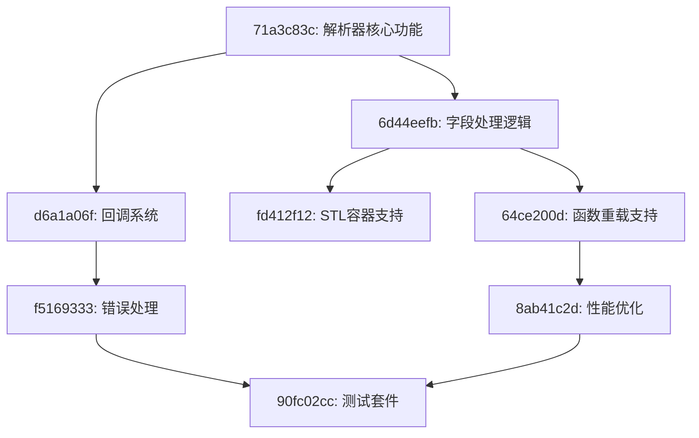
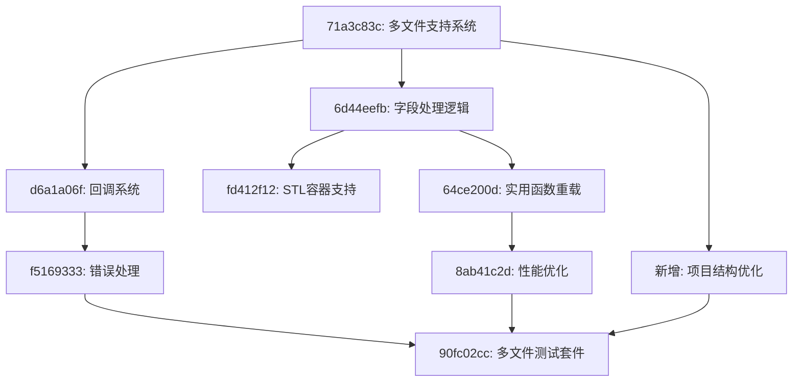

# 任务依赖关系图表

## 📊 依赖关系可视化

### 修正前的依赖关系


### 修正后的依赖关系（重点调整）


## 🎯 关键路径分析

### 主要执行路径
1. **核心路径**: A1 → B1 → D1 → F1 → H1
   - 多文件支持 → 字段处理 → STL容器 → 性能优化 → 测试套件
   - **预计时间**: 12-16周

2. **回调路径**: A1 → C1 → G1 → H1
   - 多文件支持 → 回调系统 → 错误处理 → 测试套件
   - **预计时间**: 10-14周

3. **重载路径**: A1 → B1 → E1 → F1 → H1
   - 多文件支持 → 字段处理 → 函数重载 → 性能优化 → 测试套件
   - **预计时间**: 10-14周

### 并行执行机会
```
阶段1（并行）:
├── 71a3c83c: 多文件支持系统 (4-6周)
└── 新增: 项目结构优化 (2-3周)

阶段2（并行）:
├── 6d44eefb: 字段处理逻辑 (3-4周)
└── d6a1a06f: 回调系统 (3-4周)

阶段3（并行）:
├── fd412f12: STL容器支持 (2-3周)
├── 64ce200d: 函数重载支持 (2-3周)
└── f5169333: 错误处理 (2-3周)

阶段4:
├── 8ab41c2d: 性能优化 (2-3周)
└── 90fc02cc: 测试套件 (3-4周)
```

## 📋 任务分组策略

### 组1: 基础架构组
- **任务**: 71a3c83c (多文件支持)
- **特点**: 最高优先级，阻塞其他任务
- **资源**: 需要最强开发者
- **时间**: 4-6周

### 组2: 核心功能组
- **任务**: 6d44eefb (字段处理), d6a1a06f (回调系统)
- **特点**: 可以并行开发
- **依赖**: 组1完成后开始
- **时间**: 3-4周

### 组3: 扩展功能组
- **任务**: fd412f12 (STL容器), 64ce200d (函数重载), f5169333 (错误处理)
- **特点**: 独立性较强，可并行
- **依赖**: 组2完成后开始
- **时间**: 2-3周

### 组4: 质量保证组
- **任务**: 8ab41c2d (性能优化), 90fc02cc (测试套件)
- **特点**: 整合所有功能
- **依赖**: 前面组基本完成
- **时间**: 3-4周

## 🚀 执行建议

### 立即开始
1. **修正任务71a3c83c**: 将内容从模板特化等改为多文件支持
2. **创建项目结构优化任务**: 补充当前缺失的项目组织任务
3. **更新测试任务90fc02cc**: 包含多文件场景的测试需求

### 资源分配建议
- **高级开发者**: 负责组1的多文件支持系统
- **中级开发者**: 负责组2的核心功能开发
- **初级开发者**: 协助组3的扩展功能和测试编写

### 风险控制
1. **关键依赖监控**: 71a3c83c任务的进度直接影响整体时间线
2. **技术风险评估**: 多文件支持的复杂度可能超出预期
3. **质量关卡**: 每个组完成后进行全面测试验证

## 📊 进度跟踪指标

### 关键里程碑
- **第4周**: 多文件支持基础完成
- **第8周**: 核心功能组完成
- **第12周**: 扩展功能组完成  
- **第16周**: 整体项目完成

### 质量指标
- **代码覆盖率**: 每个任务完成后 >80%
- **性能基准**: 大型多文件项目处理时间 <30秒
- **稳定性**: 连续集成通过率 >95%

---
**图表生成时间**: 2025年6月4日  
**工具**: mermaid + 手工分析  
**状态**: 等待任务修正后更新依赖关系
